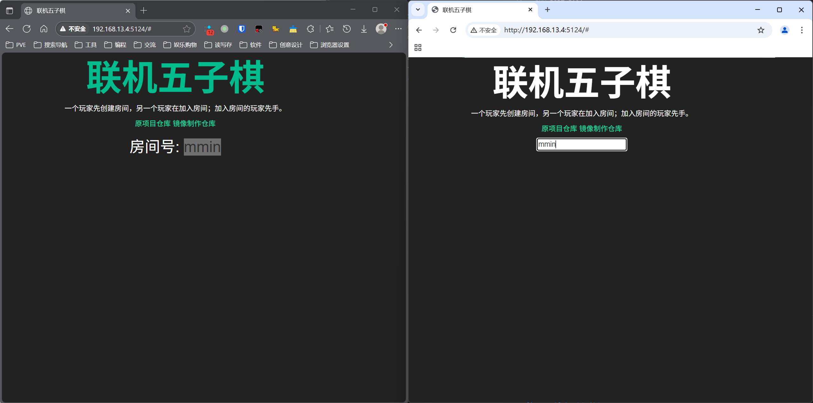
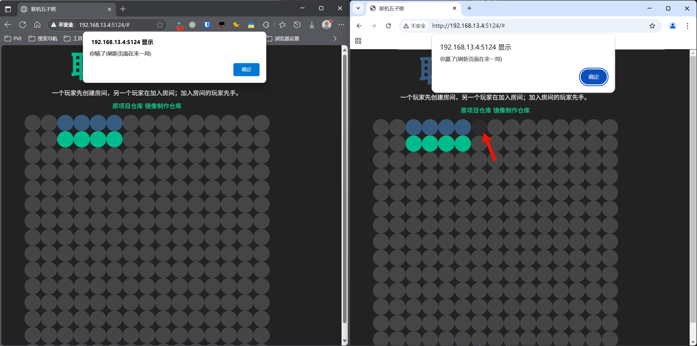

## Gomoku 五子棋


**Gomoku** is an [abstract
strategy](https://en.wikipedia.org/wiki/Abstract_strategy) [board game](https://en.wikipedia.org/wiki/Board_game). Also called **Gobang** or **Five in a Row**, it is traditionally played with [Go](https://en.wikipedia.org/wiki/Go_(game)) pieces (black and white stones) on a go board with 19x19 (15x15) intersections.  
五子棋是一种 抽象策略 类型的 棋盘游戏。它也被称为连珠或五子连线。传统上，这个游戏使用 围棋 的棋子（黑子和白子）在一个 19x19（或 15x15）交叉点的围棋棋盘上进行。

The winner is the first player to get an unbroken row of five stones horizontally, vertically, or diagonally.  
获胜条件是：任意一方先在水平、垂直或对角线上形成一条连续的五个同色棋子的直线（不可中断）。

## 汉化&修改

当前汉化版本：

首先感谢原作者的开源。[原项目地址](https://github.com/ChrisWiles/GomokuReact)

具体汉化了那些内容，请参考[翻译说明](./翻译说明.md)。

只做了汉化和简单修改，有问题，请到原作者仓库处反馈。

欢迎关注我B站账号 [秦曱凧](https://space.bilibili.com/17547201)

有需要帮忙部署这个项目的朋友,一杯奶茶,即可程远程帮你部署，需要可联系。  
微信号 `E-0_0-`  
闲鱼搜索用户 `明月人间`  
或者邮箱 `firfe163@163.com`  
如果这个项目有帮到你。欢迎start。

有其他的项目的汉化需求，欢迎提issue。或其他方式联系通知。

### 镜像

从阿里云或华为云镜像仓库拉取镜像，注意填写镜像标签，镜像仓库中没有`latest`标签

容器内部端口`5124`，可通过设置环境变量`PORT`的值来指定监听端口。

```bash
swr.cn-north-4.myhuaweicloud.com/firfe/gomoku_pvp_1_zh-cn:2025.06.28
```

### docker run 命令部署

```bash
docker run -d \
--name gomoku_pvp_1_zh-cn \
--network bridge \
--restart always \
--log-opt max-size=1m \
--log-opt max-file=1 \
-p 5124:5124 \
swr.cn-north-4.myhuaweicloud.com/firfe/gomoku_pvp_1_zh-cn:2025.06.28
```
### compose 文件部署 👍推荐

```yaml
#version: '3'
services:
  gomoku_pvp_1_zh-cn:
    container_name: gomoku_pvp_1_zh-cn
    image: swr.cn-north-4.myhuaweicloud.com/firfe/gomoku_pvp_1_zh-cn:2025.06.28
    network_mode: bridge
    restart: always
    logging:
      options:
        max-size: 1m
        max-file: '1'
    ports:
      - 5124:5124
```

### 修改说明

这里对除了汉化之外的代码修改的说明。  
增加修改部分具体见 [修改说明](./修改说明.md)。

`./README.md` 文件翻译，增加 `## 汉化&修改`

增加目录 `./图片`
新增文件 `./.dockerignore`、`./Dockerfile`、`./翻译说明.md`、`./修改说明.md`、`./本地调试命令记录.md` 

### 效果截图





## m,n,k-game

An **_m,n,k_-game** is an
abstract [board game](https://en.wikipedia.org/wiki/Board_game) in
which two [players](https://en.wikipedia.org/wiki/Player_(game)) take
turns in placing a stone of their [color](https://en.wikipedia.org/wiki/Color) on
an _m_×_n_ board, the winner being the player who first
gets _k_ stones of their own color in a row, horizontally,
vertically, or diagonally.Thus, [tic-tac-toe](https://en.wikipedia.org/wiki/Tic-tac-toe) is the 3,3,3-game and
free-style [gomoku](https://en.wikipedia.org/wiki/Gomoku) is the 19,19,5-game. _m,n,k_-game
is also called a **_k_-in-a-row** game on _m_×_n_ board.

### User Stories
- User wins when they get 5 in a row
- User can create a game
- User can another users game

## Tech Stack
* [React](https://facebook.github.io/react/docs/getting-started.html) - Open-source JavaScript library providing a view for data rendered as HTML
* [Heroku](https://devcenter.heroku.com/categories/reference) - Create, deploy, and manage apps in the cloud
* [Socket.io](http://www.material-ui.com/) - Google's material design UI components built with React.
* [Express](http://expressjs.com/) - Fast, unopinionated, minimalist web framework for node.
* [Bootstrap](getbootstrap.com) -  a sleek, intuitive, and powerful mobile first front-end framework for faster and easier web development.

## Todos
- Tests
- Chat
- Convert to webpack
- Highlight the winning row

## Notes

I have my custom methods be prefixed with an underscore to make them easier to identify.
